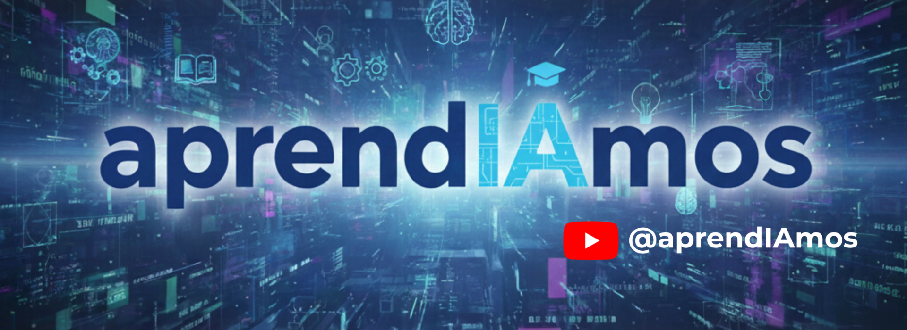
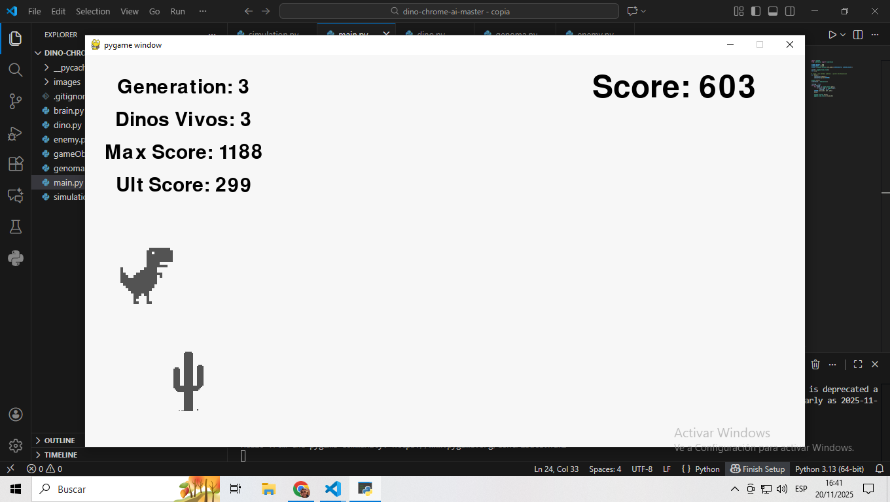
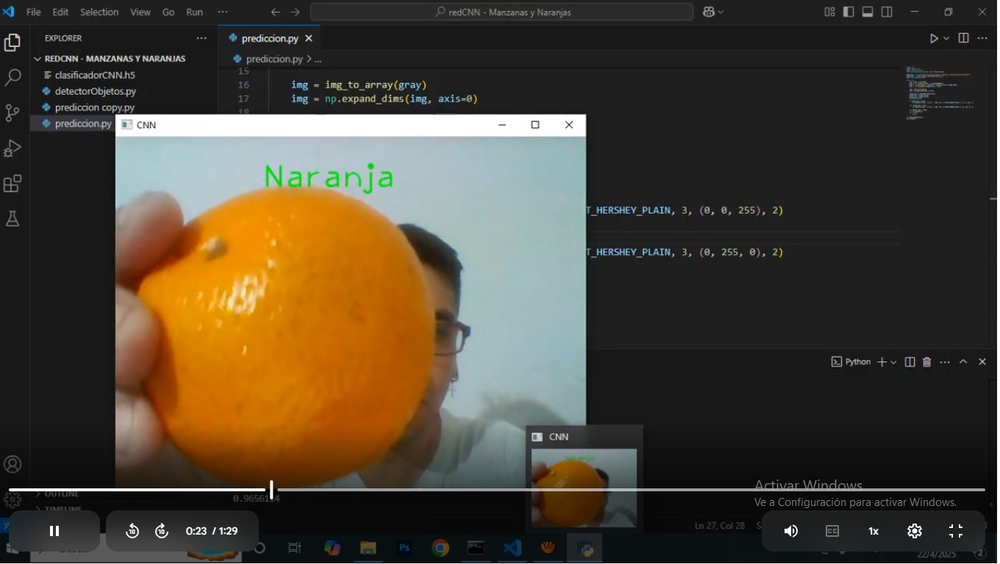
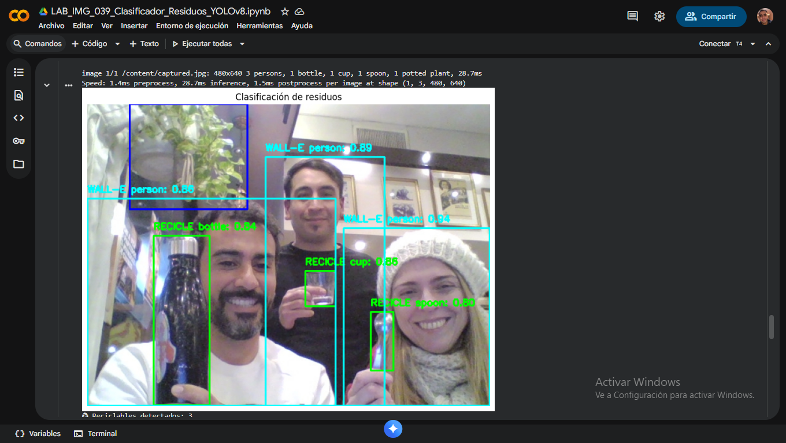
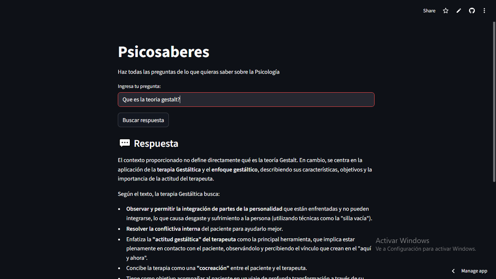

<h1 align="center"><b>Hola , Soy Hugo D. Peña </b></h1>
<!--  -->

  

## **Sobre mi**

Soy desarrollador de algoritmos de Inteligencia Artificial, Procesamiento de Lenguaje Natural y Visión por Computadora, con amplia experiencia en el desarrollo de modelos de IA y soluciones integrales relacionadas. Mi pasión es ser docente se refleja en mi canal de [YouTube](https://www.youtube.com/aprendIAmos) donde he publicado más de 50 videos y tutoriales sobre técnicas de programación, programación orientada a objetos y bases de datos. Puedes encontrar todos esos proyectos y modelos aquí en mi GitHub.

## Proyectos IA:
<table>
<tr>
<td width="50%">
<h3 align="center">Dino de Chrome juega con IA y AG</h3>

<!--  -->

Entrena a tu propio <strong>Dino de Chrome súper inteligente</strong>. Usando redes neuronales y algoritmos genéticos, verás cómo el dinosaurio evoluciona generación tras generación hasta convertirse en un jugador imposible de vencer. Observa su aprendizaje en tiempo real y modifica el código para crear comportamientos aún más locos.

                                                                                      
</td>

<td width="50%">
                
<h3 align="center">Clasificador Naranjas/Manzanas con CNN</h3>

                                       

 

<!--  -->

Desarrolla un sistema de <strong>visión por computadora</strong> basado en una <strong>Red Neuronal Convolucional (CNN)</strong> para clasificar imágenes de <strong>Naranjas</strong> y <strong>Manzanas</strong>. El proyecto incluye preprocesamiento del dataset, construcción del modelo, entrenamiento supervisado y evaluación del rendimiento. Además, podrás probar el clasificador en tiempo real y ajustar parámetros para mejorar su precisión.

                                                             
</table>                                                                                 

 

<table>
<tr>
<td width="50%">
<h3 align="center">Detector de objetos reciclables</h3>

<!--  -->

Aprende a programar un <strong>detector inteligente de residuos</strong>. Una clase práctica donde te enseño a utilizar <strong>visión por computadora</strong> y modelos de <strong>detección de objetos</strong> para identificar si un elemento es <strong>reciclable</strong> u <strong>orgánico</strong> en <strong>Tiempo REAL</strong>. Construye tu propio sistema automatizado para clasificación de basura y descarga todo el código listo para usar.

                                                                                      
</td>       

<td width="50%">
<h3 align="center">Chatbot inteligente con LangChain</h3>

<!--  -->

Aprende a programar un <strong>Chatbot Inteligente</strong> usando <strong>LangChain</strong>. Una clase práctica donde te enseño a combinar modelos de lenguaje, memoria, herramientas y cadenas para crear un asistente capaz de responder, razonar y mantener conversaciones en <strong>Tiempo REAL</strong>. Construye tu propio sistema conversacional con IA y descarga todo el código listo para usar y modificar.

                                                                                      
</td>  
</table>                                                                                 

 

## Habilidades y lenguajes:

### Lenguajes:

### Habilidades:

### Frameworks & Librerías:

## Contacto:
